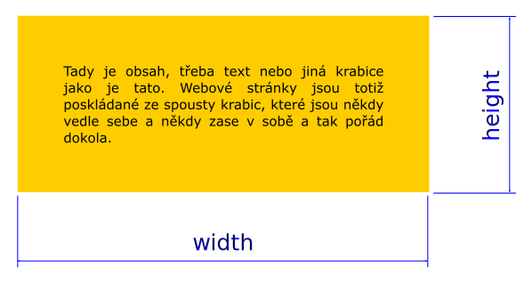
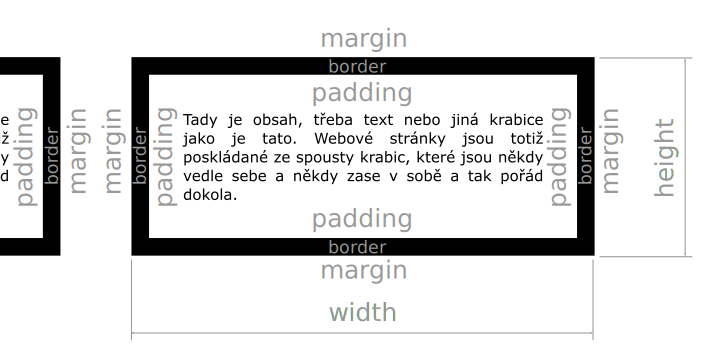

# CSS

Posledně jsme si ukázali z CSS jen malou část. Dnes si znalosti CSS rozšíříme.

---

## Výchozí styly (User Agent stylesheet)

----

Každý prohlížeč má v sobě zabudované výchozí CSS.

Proto každý HTML dokument „bez CSS“ má nadpisy, které jsou tučně a větším písmem než odstavce. 

Tvoje CSS se aplikuje až za nimi a tak vlastně přepisuješ vlastnosti zabudované v prohlížeči.

---

## Vlastnosti textu

----

```css
p {
	font-style: italic;  /* nebo normal */

	font-weight: bold; /* nebo normal */

	font-family: sans-serif; /* nebo serif */

	text-align: center; /* nebo left nebo right */
}
```
<!-- .element: class="c-text-sm stretch" contenteditable="true" -->

----

<!-- .slide: data-state="c-slide-task" -->

#### Cvičení

Zkus všechny použít na prvky v tvém `index.html`.

----

## Dědičnost (inheritance)

Rodič je element do kterého je nějaký element zanořen. Například rodičem `<body>` je  `<html>`.

Některé vlastnosti se dědí, tedy přenášejí z rodičů na potomky. Typicky jsou to právě ty, které nastavují vlastnosti textu. Nastavíš-li například druh písma pro `<body>`, nastavuješ ho v podstatě celému dokumentu.  
 
----

<!-- .slide: data-state="c-slide-task" -->

#### Cvičení

Zkus si zjistit a ověřit dědičnost vlastností, které jsme už probírali, v tvém dokumentu `index.html`.

----

## Velikost textu

Velikost písma můžeš nastavit pomocí spousty jednotek zatím si vystačíme s pixely (`px`) a procenty `%`, kdy se velikost určuje dle velikosti písma rodiče.

```css
font-size: 20px;
font-size: 150%;
```

---

## Barva pozadí

----

Barvu pozadí už nastavit umíš: 

```css
p {
    background-color: green;
}
```

Co ale když chceš přidat pozadí pod několik elementů zároveň? K tomu je potřeba přidat extra prvek.
Protože tento prvek nemá žádný jiný význam, použij `<div>`, prvek bez významu.

```html
<div>
    <h2>Nejnovější novinka</h2>
    <p>Dnes je spoustu nového…</p>
    <a href="detail.html">celá novinka</a>
</div>
```
----

<!-- .slide: data-state="c-slide-task" -->

#### Cvičení

V tvém dokumentu `index.html` obal několik prvků do `<div>` a dej mu nějaké pěkné pozadí nebo třeba všem nastav jiné písmo jen s pomocí dědičnosti.

---

## Třídy

----

# Jak odlišit elementy? <!-- .element: class="c-sr-only" -->

```html
<p>A víte, že…?</p>

<p>Ještě jeden odstavec</p>

```
<!-- .element: class="c-text-md" contenteditable="true" -->

Co kdybych chtěl zobrazit text odstavců modře?

```css
p { color: blue; }
```
<!-- .element: class="c-text-md fragment" contenteditable="true" -->

Ale co kdybych chtěl udělat jen první odstavec modrý?

Řešením je přidat třídu, která umožňuje se zaměřit v CSS přesněji. Třída se v HTML přidává jako atribut `class`…

```html
<p class="tip">A víte, že…?</p>

<p>Ještě jeden odstavec</p>

```
<!-- .element: class="c-text-md" contenteditable="true" -->

… a v CSS se zapíše s tečkou na začátku


```css
.tip { color: blue; }
```
<!-- .element: class="c-text-md fragment" contenteditable="true" -->

----

# Třída platí pro více elementů <!-- .element: class="c-sr-only" -->

Třídu můžeš přiřadit libovolnému počtu značek.


```html
<h1 class="tip">Tip</h1>

<p class="tip">A víte, že…?</p>

<p>Ještě jeden odstavec</p>

```
<!-- .element: class="c-text-md" contenteditable="true" -->

```css
.tip { color: blue; }
```
<!-- .element: class="c-text-md" contenteditable="true" -->

Třída se tedy použije pokud má nějaký prvek speciální vlastnosti nebo se skupina vlastností opakuje a chceme si tak ušetřit opakovaný zápis v CSS.

----

## Vícenásobné třídy

Tříd můžeme jednomu prvku přiřadit více najednou, oddělujeme je mezerou.

```css
.tip { color: red; }
.cool { background-color: skyblue; }
```
<!-- .element: class="c-text-md " contenteditable="true" -->

```html
<p class="tip">Jsem Tip</p>
<p class="cool">Já jsem cool</p>
<p class="cool tip">Já jsem oboje, heč.</p>
```
<!-- .element: class="c-text-md " contenteditable="true" -->


----

<!-- .slide: data-state="c-slide-task" -->

#### Cvičení

Zkus si změnit stylování v tvém dokumentu pomocí elementů na stylování pouze pomocí tříd.  

---

# [Box-model](https://devdocs.io/css/css_box_model/introduction_to_the_css_box_model)

Na stránce je každý element reprezentovaný jako obdélníková krabice. Tvar nemusí být vidět, ale je tam.

----

<!-- .slide: data-state="c-slide-video" -->

Podívej se na video, které velmi zpomaleně zachycuje vykreslování stránky v prohlížeči, tak jak si ji postupně skládá, je tam spousta krabic. 

<iframe data-autoplay width="100%" height="400px" src="https://www.youtube.com/embed/ZTnIxIA5KGw" frameborder="0" allowfullscreen></iframe>

----

## [box-sizing](https://devdocs.io/css/box-sizing)

`box-sizing` je vlastnost, která určuje jaký druh box-modelu použít. Ve většině případů chceš použít ten, který není v CSS v prohlížeči jako výchozí, proto hned na začátek svého CSS dej tento kód.


```css
*, 
*:before, 
*:after { 
	box-sizing: border-box; 
}
```
<!-- .element: class="c-text-md" contenteditable="true" -->

Vysvětlení jaký je rozdíl nechme na později, teď jen chceme aby to prohlížeč vykresloval tak, jak potřebujeme.

----

## Výška a šířka

```css
img {
	width: 300px;
	height: 100px;
}
```
<!-- .element: class="c-text-md " contenteditable="true" -->



----

## Ohraničení

Rámeček kolem prvku.

```css
img {
	border-width: 2px;
	border-style: solid; /* taky dotted, dashed nebo inset */
	border-color: black;
}
```

<!-- .element: class="c-text-xs fragment" contenteditable="true" -->

Zkrácený zápis (tzv. shorthand):

```css
img {
	border: 2px solid black;
}

```
<!-- .element: class="c-text-sm fragment" contenteditable="true" -->


----

## Odsazení obsahu od okraje (od rámečku)

Je to vlastně taková „vycpávka“. 

```css
.tip {
	padding: 25px;
}
```
<!-- .element: class="c-text-md " contenteditable="true" -->


Jedna hodnota nastaví shodné odsazení na všech 4 stranách prvku.

----

## Odsazení od ostatních prvků

Určuje to, jak daleko mají být ostatní prvky od rámečku (i kdyby byl nulový).

```css
.tip {
	margin: 10px;
}
```
<!-- .element: class="c-text-md " contenteditable="true" -->


Pozor na slučování hodnot, kdy se aplikuje jen větší ze dvou hodnot.

----

## Shrnutí



Všechny prvky na stránce bez ohledu na vizuální tvar jsou krabice/boxy.


Vlastnost `width` určuje, jak má být prvek široký *včetně* ohraničení (`border`) a výplně (`padding`)

`margin` se do šířky nezapočítává, ale ovlivňuje, kolik místa prvek ve výsledku zabere.

<!--
**Pozor při výpočtech**: nezpomeňte násobit dvěma, pokud 
	`margin: 5px;` ubere na šířku (resp. výšku) úhrnem `10 px` => vlevo a vpravo (resp. nahoře a dole). Platí i pro `padding` a `border`.
-->

----

## Blokové elementy

Zaberou celou dostupnou šířku => řadí se pod sebe, lze jim nastavovat hodnoty margin, padding atd.

----

## Řádkové elementy

* zaberou jen tolik místa, kolik potřebují
* nejsou samostatně na řádku => řadí se za sebou jako slova ve větě
* nejde jim nastavit některé vlastnosti z box modelu (šířka, výška, horní/dolní okraj)
* na tvojí stránce jsou to například odkazy, nebo důležitý text  (`strong`)

----

## Řádkově-blokové elementy

* hybrid: řádkový s některými vlastnostmi blokového
* řadí se za sebou, ale lze mu nastavit šířku, výšku a okraje
* na vaší stránce se tak chovají obrázky

----

## Typ elementu v&nbsp;CSS

```css
a { display: block; }

div { display: inline; }

li { display: inline-block; }
```
<!-- .element: class="c-text-md stretch" contenteditable="true" -->

* každý element má výchozí typ
* pomocí CSS lze ale změnit chování prvku na jiný typ
----

<!-- .slide: data-state="c-slide-task" -->

#### Cvičení

Zkus nastavit všechny vlastnosti pro jeden element.

Zkus mu změnit hodnotu display z block na ostatní. Při inline rámeček a další vlastnosti „zmizí“. 

---

## Pokročilé selektory

Základní jednoduchý selektor, tedy to, co napíšeš v CSS před složené závorky, už znáš. 

Často se ale hodí použít i komplexnější varianty, které umožňují jednodušeji nebo přesněji zacílit na elementy, které potřebuješ nastylovat.

----

### Vícenásobný selektor

Při psaní CSS jsou způsoby, jak si ušetřit opakování znovu a znovu.

```css
h1,
h2 { color: green; }
```
<!-- .element: class="c-text-lg" contenteditable="true" -->

Selektor říká: _všechny nadpisy h1 a všechny nadpisy h2_ 

Obarví nadpisy 1. a 2. úrovně na zeleno.

Jednotlivé selektory odděluj čárkou.

----

### Kontextový selektor

Někdy potřebuješ nastavit vlastnosti jen prvkům v určité části stránky, na to se hodí kontextový selektor. 

```css
.tip h2 { color: blue; }
```
<!-- .element: class="c-text-lg" contenteditable="true" -->

Selektor říká: _všechny nadpisy h2, pokud je nějaký jejich rodič libovolný element s třídou h2_

Obarví se nadpisy 2. úrovně na modro, pokud jsou v prvku s třídou `.tip`

Samozřejmě to funguje i jen pro tagy nebo jen pro třídy. A taky lze definovat více zanořených prvků, ale tomu se radši vyhni. Není to dobrá praxe a přináší to spíš problémy.

---

## Pseudotřídy

Pseudotřídy vybírají prvky v různých stavech.

----

```css
a { color: navy; }

a:link {color: blue;} /* nenavštívený */

a:visited {color: purple;} /* navštívený */

a:hover {color: red;} /* najetí myší */

a:focus {color: green;} /* aktivace klávesnicí */

a:active {color: yellow;} /* při kliknutí */
```

Zatímco třídy si definuješ jako autor kódu ty, pseudotřídy jsou dané.

Narozdíl od tříd se zapisují jen do CSS, na HTML není třeba sahat.

Je potřeba dodržet pořadí jejich zápisu v CSS, aby fungovaly správně.

---

# Jak se aplikují styly

Zjednodušíme si zatím situaci tím, že všechno CSS máme jen v jednom souboru a nikde jinde.

----

## Na pořadí záleží

```css
p {
	color: red;
	background-color: pink;
}

p { color: green; }
```

Platí poslední nastavená hodnota vlastnosti.

----

## Na specificitě selektoru víc

Předchozí pravidla platí pro selektory se stejnou _specificitou_. Co to je?

Specificita je vlastně síla selektoru. Čím více tříd selektor má, tím silnejší je.

Pokud mají dva selektory stejný počet tříd, tak je silnější ten s větším počtem tagů.

```html
<div>
    <p class="tip">obsah</p>
</div>
```

```css
p.tip { color: red; }
p { color: green; }
div p { color: blue; }
```

Specificita může být ještě složitější, ale my bychom si zatím měli vystačit s tímto.
