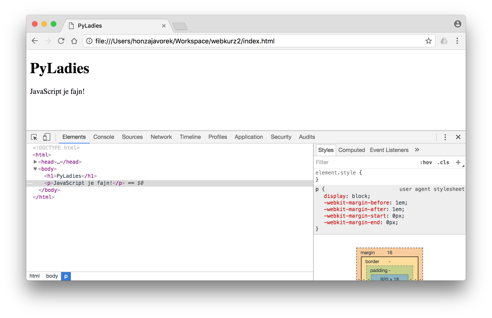

# DOM

----

Jak bylo už zmíněno, JavaScript umí přistupovat k HTML prvkům na stránce a měnit je. Jak to funguje?

Prohlížeč přečte HTML a zobrazí všechny tagy uživateli. Zároveň ale pro každý tag vytvoří i JavaScriptový objekt, se kterým můžeš pracovat ve svém programu. Pokud na něm uděláš jakékoliv změny, prohlížeč je okamžitě aplikuje i v tom, jak tag zobrazuje.

Tomuto systému se říká DOM, _Document Object Model_. Tato lekce tě naučí, jak s ním lze pracovat.

---

## První příklad

----

Vytvoř si HTML stránku s několika tagy a připojeným souborem `dom.js`:

```html
<!DOCTYPE HTML>
<html>
    <head>
        <title>PyLadies</title>
        <script src="dom.js"></script>
    </head>
    <body>
        <h1>PyLadies</h1>
        <p></p>
    </body>
</html>
```

Náš první JavaScriptový program, který pracuje s DOMem, bude vypadat následovně:

```js
function addText() {
    var tags = document.getElementsByTagName('p');
    var p = tags[0];
    p.innerText = 'JavaScript je fajn!';
}
window.onload = addText;
```

V JavaScriptu je několik objektů, které máš k dispozici kdekoliv ve svém programu a proto se jim říká _globální_. Zpřístupňují určité věci z prohlížeče. S&nbsp;objektem `window` ses již setkala, ten představuje okno prohlížeče (nebo spíš prohlížeč jako takový). K tagům na stránce se můžeš dostat přes jiný globální objekt, `document`.

Funkce `document.getElementsByTagName()` přijímá název tagu a vrátí pole všech tagů toho názvu, jaké najde na stránce. My víme, že máme na stránce jeden tag s názvem `p`, tak si z pole vytáhneme první prvek a změníme mu následně text, který obsahuje. To se dělá přiřazením do vlastnosti `innerText`.

Kód, který manipuluje s DOMem, je dobré spouštět až ve chvíli, kdy má prohlížeč celé HTML přečtené a všechny tagy zobrazené. Když se prohlížeč snaží zobrazit HTML stránku, čte totiž HTML tagy postupně, shora dolů. JavaScript připojujeme ke stránce dřív, než se na ní vyskytuje tag `<p></p>`, takže by se mohlo stát, že v době spuštění našeho programu ještě prohlížeč o žádném `p` ještě nebude vědět. Potom by funkce `document.getElementsByTagName('p')` mohla vrátit prázdné pole.

Naštěstí lze tomuto předejít. Ve chvíli, kdy má prohlížeč celou stránku zpracovanou, spustí funkci, která bude přiřazená do vlastnosti `windows.onload`. Toho je využito i v příkladu výše.

Když si načteme stránku, objeví se nadpis a odstavec s naším dynamicky doplněným textem.

<div class="c-example">
<h1>PyLadies</h1>
<p>JavaScript je fajn!</p>
</div>

Když se podíváš do zdrojového kódu stránky (<kbd>Ctrl + U</kbd>, popřípadě <kbd>Cmd + Alt + U</kbd>), uvidíš stále své původní HTML, kde je `<p></p>` prázdné:

```html
<!DOCTYPE HTML>
<html>
    <head>
        <title>PyLadies</title>
        <script src="hello.js"></script>
    </head>
    <body>
        <h1>PyLadies</h1>
        <p></p>
    </body>
</html>
```

Pokud bys chtěla vidět i změny, které provedl JavaScript, musíš si v prohlížeči otevřít vývojářské nástroje a přepnout se v menu na _Elements_.

<figure class="image"></figure>

---

## Jak něco v DOMu vybrat

----

TBD

---

## Jak něco v DOMu změnit

----

### změnit/přidat/odebrat třídy
čímž dostanou možnost vizuálně čarovat s tím

----

### Změnit nějaký kus HTML (vygenerovat/upravit/smazat)

---

## Knihovna jQuery

----

Možná v ní jen napsat skoro to samý

---

<!--
nejaky priklady a zakladni srandy ve vanilla js, ktery dneska uz umi skoro vsechno co jquery... pak zminit ze existuji veci, na ktery se muzou podivat dal - jquery, pripadne nejaky dnesni srandy

ale pak začít (asi) se základní magií, tedy vybrat prvek/prvky a změnit/přidat/odebrat třídu
čímž dostanou možnost vizuálně čarovat s tím

asi bych si představoval pak ukázat jQuery (možná v ní jen napsat skoro to samé)
-->
