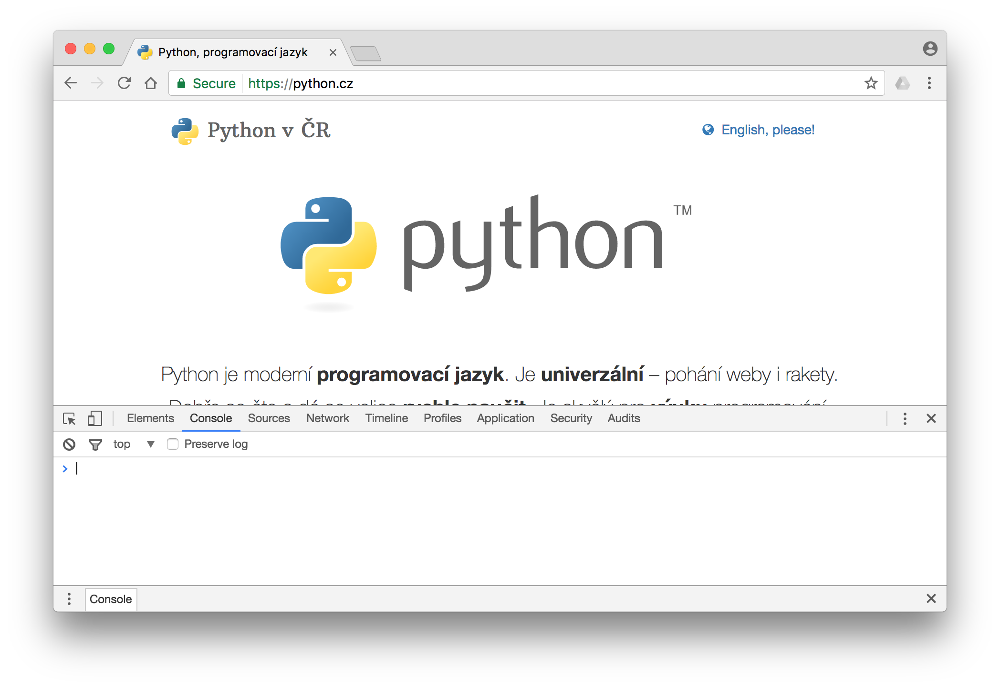
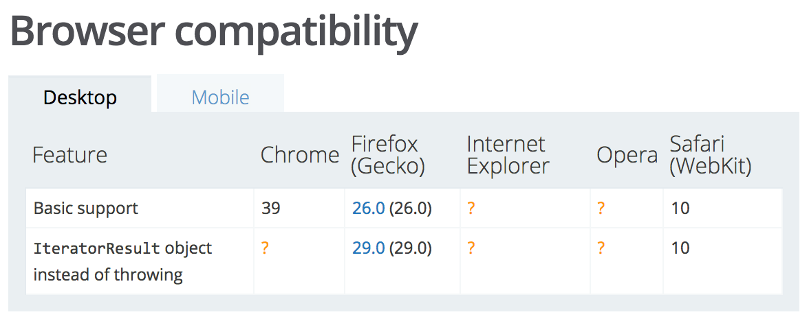

# Základy JavaScriptu

----

Už umíš vytvořit _statické_ stránky pomocí HTML a CSS. V minulé lekci jsi se navíc dověděla, že nemusíš psát všechno HTML ručně a ukládat do souborů, ale že jej lze _dynamicky_ generovat na serveru, třeba zrovna Pythonem.

Programování webových stránek se však může odehrávat nejen na straně serveru, ale i přímo u návštěvníka stránek, tedy v jeho prohlížeči. Jen jeden jazyk umí jet přímo v prohlížeči a měnit stránku u uživatele bez toho, aby bylo potřeba ji znovu načíst ze serveru. Tím jazykem je JavaScript a pro webovou tvorbu je velmi důležitý. V této lekci se naučíš jeho základy.

---

## Backend nebo frontend?

----

Python jede na serveru, generuje stránky, a posílá je uživateli do prohlížeče. Jakmile je hotové odešle, už je nijak změnit neumí. Proto se jedná o _backend_. Jako _backend_ se také označuje i všechno ostatní, co jede na serveru a uživatel to nemůže přímo vidět, jako např. databáze.

HTML, CSS a JavaScript se interpretují v prohlížeči u uživatele, takže se jedná o _frontend_.

---

## Co je v JavaScriptu možné?

----

- reagovat na to, že uživatel pohne myší, posouvá stránku, označí text.
- jakkoliv měnit strukturu HTML a CSS vlastnosti dané stránky:
    - animovat věci na stránce
    - posouvat věci, skrývat, odkrývat, přebarvovat
    - zmenšovat nebo zvětšovat prvky na stránce
    - přidávat nové HTML i s textem, přepisovat existující
- přistupovat k informacím, které poskytuje prohlížeč:
    - datum a čas u uživatele
    - jestli je uživatel ve tmě nebo na světle, kolik má baterky
    - ovládat audio a video na stránce
    - jakým směrem je natočeno jeho zařízení, GPS pozice
- získávat informace ze serveru i bez nového načtení stránky

---

## JavaScript vs. Python

----

Jednoduchý program v JavaScriptu a ekvivalentní program v Pythonu mohou vypadat třeba takto:

```js
function isUkulele(stringsCount) {
    if (stringsCount == 4) {
       return true;
    } else {
       return false;
    }
}

console.log(isUkulele(6)); // asi spíš kytara
```

```python
def is_ukulele(strings_count):
    if strings_count == 4:
        return True
    else:
        return False

print(is_ukulele(6))  # asi spíš kytara
```

Všimni si zejména následujících rozdílů:

- Místo odsazení a dvojteček označuje bloky kódu dvojice závorek: `{` a `}`
- Příkazy se ukončují středníkem. Nebo také ne. Je nepovinný. Vývojáři se o to, zda v JavaScriptu středníky psát nebo ne, přou po staletí.
- Zatímco v Pythonu je zvykem pojmenovávat proměnné a funkce s podtržítkem mezi slovy, v JavaScriptu se používá tzv. _camelCase_ konvence.

I přesto, že je mezi zápisy obou jazyků spousta rozdílů, jsi schopná program v JavaScriptu přečíst a do jisté míry mu porozumět. Není tedy čeho se bát, je to jako bys uměla Italsky a zajela si na dovolenou do Barcelony. Něco vyloženě znáš, základy tušíš, složitější věci si vyhledáš.

---

### Odsazení

----

Velkým rozdílem mezi oběma jazyky je skutečnost, že v případě JavaScriptu slouží odsazení pouze k tomu, aby se program lépe četl lidem. Žádný jiný význam nemá.

Tento program bude fungovat úplně stejně, jako úvodní příklad:

```js
function isUkulele(stringsCount) { if (stringsCount == 4) { return true; } else { return false; } }; console.log(isUkulele(6));
```

---

### Konzole

----

Když si chceš vyzkoušet kousky Pythonu, můžeš použít interaktivní `python` nebo `ipython` v příkazové řádce. Jak si ale můžeš vyzkoušet JavaScript, který by se měl spouštět v prohlížeči?

Otevři si prohlížeč Google Chrome a použij klávesovou zkratku <kbd>Ctrl + Shift + J</kbd> (na Macu <kbd>Cmd + Alt + J</kbd>). Měla by se ti otevřít _vývojářská konzole_, kde můžeme spouštět JavaScript.

<figure class="image"></figure>

Tam, kde ti bliká kurzor, vlož následující kód:

```js
console.log('Hello, ' + window.prompt('Please, enter your name') + '!');
```

Stiskni <kbd>Enter</kbd>. Stránka se tě zeptá na jméno (funkce `window.prompt()`) a vypíše jej s pozdravem (funkce `console.log`).

Můžeš zkusit vložit i jednořádkový kód, jenž jsme si ukázali v předchozí sekci tohoto návodu, a ověřit tak, že opravdu i bez odsazování bude program fungovat. Dostaneš výsledek volání funkce `console.log(isUkulele(6))`, tedy `false` (ukulele má struny čtyři, ne šest).

----
<!-- .slide: data-state="c-slide-task" -->

## Cvičení

Zkoušej zadávat i další věci. Do konzole lze vypisovat pomocí `console.log()`, ale budou fungovat i výrazy jako `7 * 6` a i další věci, které už znáš z Pythonu. Nemusíš psát vše na jeden řádek, konzole podporuje i víceřádkový vstup a dokonce se ti pokusí i napovídat (nápovědy lze odsouhlasit a použít pomocí <kbd>Tab</kbd>), podobně jako to umí `ipython`.

Všimni si, že nad konzolí je menu, přes které se můžeš dostat i na další vývojářské nástroje. Ty slouží k tomu, abys mohla různě prozkoumávat aktuálně načtenou webovou stránku. Konzole a i všechny další vývojářské nástroje v Google Chrome [mají svou dokumentaci][chrome-console], kde se můžeš dovědět více.

[chrome-console]: https://developers.google.com/web/tools/chrome-devtools/

---

### Proměnné

----

Když si chceme v Pythonu nastavit nějakou novou proměnnou, stačí nám udělat toto:

```python
strings_count = 4
```

Proměnná bez hodnoty nemůže existovat. V JavaScriptu je to trochu jinak. Máme klíčové slovo `var` (jako _variable_, angl. proměnná), jímž v programu říkáme: "Vytvoř mi novou proměnnou s tímto názvem." Volitelně můžeme přidat i počáteční hodnotu. Ukažme si to třeba na funkci, která z hodiny umí poznat, zda je den, nebo noc.

```js
function getTimePeriod(now) {
    // nová proměnná, bez hodnoty
    var timePeriod;

    // nová proměnná, s počáteční hodnotou
    var hour = now.getHours();

    if (hour > 6 && hour < 22) {
        timePeriod = 'day';
    } else {
        timePeriod = 'night';
    }

    return timePeriod;
}

var now = new Date();
console.log(getTimePeriod(now));
```

Proměnnou `timePeriod` jsme vytvořili prázdnou, a až později jsme do ní přiřadili nějakou hodnotu. Proměnnou `hour` jsme ale vytvořili už rovnou s nějakou počáteční hodnotou. Způsob, jakým v JavaScriptu fungují proměnné, je složitější, ale toto nám bude prozatím stačit.

---
<!-- .slide: data-state="c-slide-task" -->

## Cvičení

[`new Date()`][js-now] vytváří objekt s aktuálním datem a časem. Je to něco jako [`datetime.now()`][py-now] v Pythonu. Představ si, že máš web vytvořený ve Flasku a v šabloně budeš do HTML vypisovat výsledek `datetime.now()`. Na té samé stránce budeš spouštět `new Date()` v JavaScriptu. Web budeš provozovat na nějakém serveru v ČR. Bude se nějak lišit výsledek `new Date()` a `datetime.now()`,

- když si stránku načteš z Českých Budějovic?
- když si stránku načteš z Tokia?

[js-now]: https://developer.mozilla.org/en/docs/Web/JavaScript/Reference/Global_Objects/Date
[py-now]: https://docs.python.org/3/library/datetime.html#datetime.datetime.now

<details>
    <summary>Řešení</summary>
    <p>
        Protože JavaScript běží u návštěvníka stránek v prohlížeči, dostaneme vždy čas, jaký má nastavený uživatelův počítač. To znamená, že ve stejný okamžik dostane tvůj program v JavaScriptu jiný čas, pokud jej načte uživatel v ČR a pokud jej načte uživatel v Japonsku.
    </p>
    <p>
        Oproti tomu Python pracuje vždy s časem na serveru. Když pojedou naše stránky na serveru, který se nachází v ČR a má nastavený středoevropský čas, budeme všem uživatelům na světě ukazovat stále stejný, středoevropský čas.
    </p>
</details>

---

### Datové struktury

----

JavaScript nemá seznamy a slovníky. Místo toho má [pole][] (angl. _array_) a [objekty][] (angl. _object_).

[pole]: https://developer.mozilla.org/en-US/docs/Web/JavaScript/Guide/Indexed_collections
[objekty]: https://developer.mozilla.org/en-US/docs/Web/JavaScript/Guide/Working_with_Objects

```js
var clothes = [
    'shoes',
    't-shirt',
    'hat',
    'skirt',
    'socks',
];
console.log(clothes[1]); // vypíše t-shirt

var angryBirdsScore = {
    'veronika': 6810,
    'dan': 4245,
    'zuzka': 29233,
    'honza': 3824,
};
console.log(angryBirdsScore['honza']); // vypíše 3824
```

Jak je vidět, na první pohled vypadají stejně. Občas se ale chovají trochu jinak, takže je dobré vždy ověřit, co přesně s nimi můžeš dělat a jak.

Například pokud název vlastnosti objektu neobsahuje žádné speciální znaky, můžeš ho zapisovat i bez uvozovek a přistupovat k nim přes tečku:

```js
var population = {
  karvina: 65141,
  ostrava: 294200,
  'frydek-mistek': 56945,
};
console.log(population.karvina); // vypíše 65141
console.log(population['ostrava']); // 294200
console.log(population['frydek-mistek']); // 56945
```

---

### Připojení JS

----

Podobně jako CSS, i JavaScript můžeš uložit do souboru a připojit k webové stránce v jejím HTML. Vytvoř si do prázdné složky jednoduchou webovou stránku, pojmenovanou třeba `index.html`:

```html
<!DOCTYPE HTML>
<html>
    <head>
        <title>PyLadies</title>
        <script src="hello.js"></script>
    </head>
    <body>
        <h1>PyLadies</h1>
        <p>PyLadies jsou <strong>nejlepší</strong>!</p>
    </body>
</html>
```

Nyní si vedle ní vytvoř soubor `hello.js`:

```js
console.log('Hello!');
```

Když si stránku otevřeš v prohlížeči a podíváš se do konzole, uvidíš, že se v ní objevilo `Hello!`. Prohlížeč si spolu se stránkou stáhl i tvůj soubor s JavaScriptem a spustil jej jako program.

Úvod lekce zmiňoval animace a další zábavné věci. Pozdravy vypsané do konzole, přiznejme si to, ostřílenou PyLady už moc nenadchnou. Zkus tedy místo `console.log()` použít funkci `window.alert()`:

```js
window.alert('Hello!');
```

Funkce `window.alert()` vytvoří vyskakovací tabulku s textem, který ji předáme. Uživatel bude muset tabulku potvrdit tlačítkem <button>OK</button>, jinak nezmizí.

----
<!-- .slide: data-state="c-slide-task" -->

## Cvičení

Funkce [`window.alert()`][alert] je asi nejznámější funkcí JavaScriptu vůbec a použita byla i ve _Cvičení pro odvážné_, v lekci o šablonách. [`window.prompt()`][prompt], která umí načíst vstup od uživatele, se zase objevila jen o něco výš v této lekci, při vysvětlování konzole v prohlížeči. Zkus použít tyto dvě uvedené funkce a sama prozkoumej, co dělá třetí podobná, [`window.confirm()`][confirm].

[alert]: https://developer.mozilla.org/en-US/docs/Web/API/Window/alert
[confirm]: https://developer.mozilla.org/en-US/docs/Web/API/Window/confirm
[prompt]: https://developer.mozilla.org/en-US/docs/Web/API/Window/prompt

---

### Různé prohlížeče, různý JavaScript

----

Když programuješ v Pythonu, měla by sis hlídat verzi jazyka, jakou používáš. Možná víš, že pokud vytvoříš program, který lze spustit na Pythonu verze 3, nemusí jít spustit např. na verzi 2.7.

S JavaScriptem v prohlížeči je to o něco složitější. Prohlížečů je více (Chrome, Safari, Firefox, a další) a každý z nich může JavaScript interpretovat trochu jinak. Není tedy až tolik podstatná verze jazyka, ale zda tu kterou funkcionalitu daný prohlížeč podporuje a třeba i do jaké míry.

[Nejucelenější dokumentace k JavaScriptu][js-doc] je na MDN, což je web pro vývojáře od organizace Mozilla, která stojí za prohlížečem [Firefox][]. Na každé stránce pojednávající o nějaké části JavaScriptu je vždy dole tabulka, jak si vysvětlovaná funkcionalita stojí z hlediska podpory v různých prohlížečích.

<figure class="image"></figure>

Hodit se může i již zmiňované [caniuse.com][caniuse], kde jsou kromě HTML a CSS pokryty některé oblasti JavaScriptu.

[js-doc]: https://developer.mozilla.org/en-US/docs/Web/JavaScript
[Firefox]: https://www.mozilla.org/cs/firefox/products/
[caniuse]: http://caniuse.com/#cats=JS%20API
